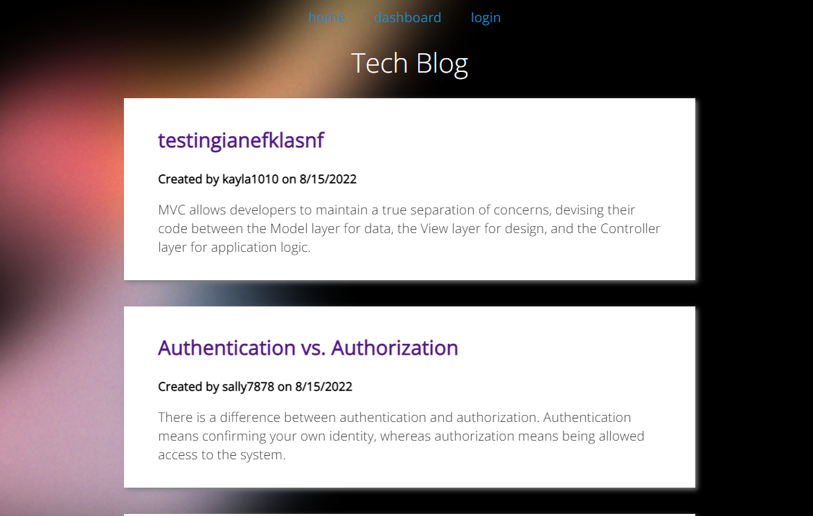

# Tech Blog

## Application Description
This full-stack website is a tech blog. All who visit the site are able to see posts and comments on the home page. To post or comment a user must sign in. Users can either login or sign up with a username, email, and password. Upon signing in, they can see they dashboard where they can add a new post or edit or delete an existing one and be brought back to a refreshed dashboard. They can also comment on posts once logged in. 

## Challenge Description
I began this challenge by creating a database, seed data, and models for mysql. I then tested backend api get/post/put/delete routes in insomnia. I then created routes for rendering the front end webpages via handlebars. Finally I connected the handlebar html pages to public JavaScript files for button handling and css styling which were able to be viewed on localhost and are deployed to Heroku. 

## User Story

```
AS A developer who writes about tech
I WANT a CMS-style blog site
SO THAT I can publish articles, blog posts, and my thoughts and opinions
```

## Acceptance Criteria

```
GIVEN a CMS-style blog site
WHEN I visit the site for the first time
THEN I am presented with the homepage, which includes existing blog posts if any have been posted; navigation links for the homepage and the dashboard; and the option to log in
WHEN I click on the homepage option
THEN I am taken to the homepage
WHEN I click on any other links in the navigation
THEN I am prompted to either sign up or sign in
WHEN I choose to sign up
THEN I am prompted to create a username and password
WHEN I click on the sign-up button
THEN my user credentials are saved and I am logged into the site
WHEN I revisit the site at a later time and choose to sign in
THEN I am prompted to enter my username and password
WHEN I am signed in to the site
THEN I see navigation links for the homepage, the dashboard, and the option to log out
WHEN I click on the homepage option in the navigation
THEN I am taken to the homepage and presented with existing blog posts that include the post title and the date created
WHEN I click on an existing blog post
THEN I am presented with the post title, contents, post creator’s username, and date created for that post and have the option to leave a comment
WHEN I enter a comment and click on the submit button while signed in
THEN the comment is saved and the post is updated to display the comment, the comment creator’s username, and the date created
WHEN I click on the dashboard option in the navigation
THEN I am taken to the dashboard and presented with any blog posts I have already created and the option to add a new blog post
WHEN I click on the button to add a new blog post
THEN I am prompted to enter both a title and contents for my blog post
WHEN I click on the button to create a new blog post
THEN the title and contents of my post are saved and I am taken back to an updated dashboard with my new blog post
WHEN I click on one of my existing posts in the dashboard
THEN I am able to delete or update my post and taken back to an updated dashboard
WHEN I click on the logout option in the navigation
THEN I am signed out of the site
WHEN I am idle on the site for more than a set time
THEN I am able to view comments but I am prompted to log in again before I can add, update, or delete comments
```

## Tasks Completed
The JavaScript documents include:
* api routes for post/get/put/delete, webpage rendering routes for use with handlebars, event listeners for each generated pages button functions
* node modules such as bcrypt, connect-session-sequelize, dotenv, express, express-handlebars, express-session, mysql2, nodemon, sequelize
* models for mysql table data
* comments

The Handlebars documents include:
* data rendered to html pages from the homeroutes
* for each arrays for dynamically rendered data, such as displaying newly added posts and comments
* if statements to display content or options only if a user is logged in

The JSON documents include:
* seed data for users, posts, and comments


## Languages & Tech
- JavaScript
- HTML
- CSS
- Express.js and Express Handlebars
- Node.js
- Bcrypt
- MySql
- Sequelize


## Links
* [Deployed Application](https://tech-blog-001.herokuapp.com/)

* [Repository](https://github.com/villette0/M14C-Tech_Blog)

## Screenshots)

